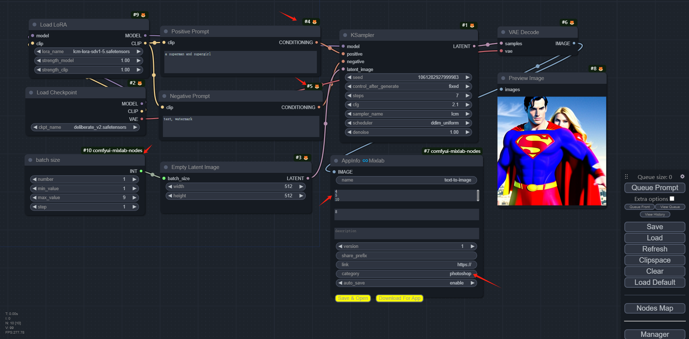
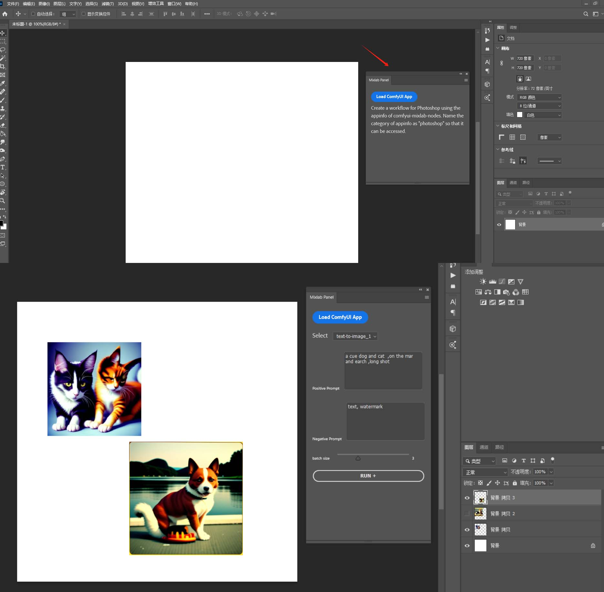

# comfyui-mixlab-ps-plugin

Turn your workflow into a Photoshop plugin.

把你的工作流变成Photoshop插件。

Create a workflow for Photoshop using the appinfo of [comfyui-mixlab-nodes](https://github.com/shadowcz007/comfyui-mixlab-nodes). Name the category of appinfo as "photoshop" so that it can be accessed.

使用[comfyui-mixlab-nodes的appinfo](https://github.com/shadowcz007/comfyui-mixlab-nodes)创建适用于Photoshop的workflow。 appinfo的category用photoshop命名即可读取

## text-to-image 

- step 1 : install [comfyui-mixlab-nodes](https://github.com/shadowcz007/comfyui-mixlab-nodes)

- step 2 : create your workflow

- step 3 : and add appinfo node.

- step 4 : install [mixlab photoshop plugin](https://github.com/shadowcz007/comfyui-ps-plugin/blob/main/dist/comfyui-mixlab-ps-plugin_PS.ccx)

## download
[comfyui-mixlab-ps-plugin_PS.ccx](./dist/comfyui-mixlab-ps-plugin_PS.ccx)

### 开发插件

安装 [UXP Developer Tool](https://developer.adobe.com/photoshop/uxp/2022/guides/devtool/)  

[uxp-photoshop-plugin-samples](https://github.com/AdobeDocs/uxp-photoshop-plugin-samples/blob/main/cross-compatible-js-sample/src/index.js)

[developer.adobe.com](https://developer.adobe.com/photoshop/uxp/2022/)

##### 答疑交流

> [discord](https://discord.gg/cXs9vZSqeK)

> 关注微信公众号：mixlab 无界社区

